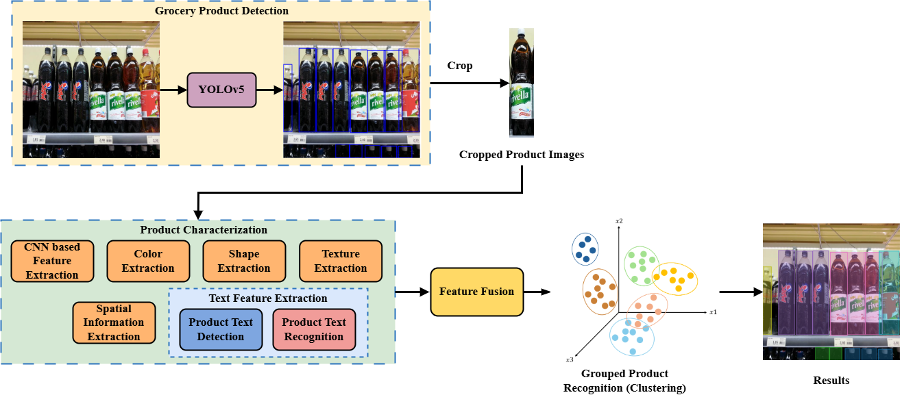

# Grouped Product Recognition from Images of Supermarket Shelves using Machine Learning
We proposed an unsupervised framework for grouped product recognition, designed to detect and cluster visually similar or identical products directly from shelf images in supermarket environments without requiring human-labeled data. Although object detection and recognition of retail products are still in their infancy, this task introduces additional challenges such as highly similar packaging. This unsupervised three-stage framework integrates YOLOv5 product detection, product characterization that extracts visual, textual, and spatial information, and unsupervised clustering methods using Agglomerative Clustering and OPTICS.

We evaluated this framework on two public datasets (Grocery Products, WebMarket) and a newly collected real-world dataset, Dutch Markets. Results show that integrating CNN, color, and spatial features achieved the highest performance.

## Summary of the Method
The proposed framework operates in three stages. First, YOLOv5 is used to detect and localize individual grocery items within the input image. Second, each cropped product goes through feature characterization, where multiple types of features are extracted, including CNN-based deep features, color histograms, shape and texture information, text from packaging, and spatial information. Finally, these features are fused into a single vector and passed to the grouped product recognition stage, which applies two unsupervised clustering algorithms: Agglomerative Clustering and OPTICS. This stage clusters visually similar products into groups without requiring manual labels. In addition to using a fixed threshold for clustering, this work explored two dynamic threshold optimization strategies: one based on the Silhouette Score and the other based on entropy.

## Validation
**Datasets:** For our experimental evaluation, we used two publicly available datasets: Grocery Products and WebMarket, and a self-collected dataset, Dutch Markets, which contains images from Dutch supermarkets. This dataset was uesd as a test to assess the framework under real-world conditions.

**Evaluation metrics:** Distinct evaluation metrics are applied at different stages of our framework. Grocery product detection stage is evaluated usinh Precision, Recall, and F1-score. For the grouped product recognition stage, we employ clustering evaluation metrics, including Adjusted Rand Index (ARI), Normalized Mutual Information (NMI), and Silhouette Score, to assess clustering quality.

**Results:** Table 1 compares our YOLOv5-based implementation for grocery product recognition with previous works and best-performing object grounding result. Our YOLOv5 model achieved a precision of 89.0%, a recall of 89.2%, and an F1-score of 89.1% on the Grocery Products dataset. On the WebMarket dataset, our implementation achieved a precision of 92.1%, a recall of 93.8%, and an F1-score of 92.94%. For Dutch Markets, the YOLOv5 model trained on Grocery Products performed the best, with a precision of 91.9%, a recall of 89.9%, and an F1-score of 90.9%, as shown in Table 2.

Table 3 presents the best clustering performance under fixed thresholds. Agglomerative Clustering with CNN + Color + Spatial features achieved the highest ARI (0.7894) and NMI (0.8020) on Grocery Products. For WebMarket and Dutch Markets, CNN-based features combined with color and texture reported the best results. As shown in Table 4, adopting Silhouette Score-based threshold optimization strategy achieved the highest performance across datasets.

| Method | Precision (%) | Recall (%) | F1-score (%) |
|--------|------|-------|-------|
| **Grocery Products**||||
| BOW | 77.7 | 76.5 | - |
| DNN | 73.1 | 73.6 | - |
| ERP+CNN | - | - | 81.05 |
| R-CNN-G | - | - | 80.21 |
| YOLOv5 | **92.1** | 86.8 | 83.3 |
| Our implementation (YOLOv5) | 89.0 | **89.2** | **89.1** |
| Our implementation (InternVL2.5, grounding) | 15.0 | 7.68 | 10.16 |
| **WebMarket**||||
| ERP+CNN | - | - | 78.76 |
| R-CNN-G | - | - | 75.50 |
| YOLOv5 | 89.4 | 88.2 | 86.3 |
| YOLOv5 + OD-Refiner | **92.56** | 85.64 | 88.97 |
| Our implementation (YOLOv5) | 92.1 | **93.8** | **92.94** |
| Our implementation (GPT-4o, grounding)| 12.8 | 4.0 | 6.1 |

Table 1: Comparison of product detection performance with existing methods and the best-performing object grounding result on the Grocery Products and WebMarket datasets.

| Model                     | Precision (%)    | Recall (%)    | F1-score (%)     |
|---------------------------|------------------|---------------|------------------|
| YOLOv5 - Grocery Products | **91.9**         | **89.9**      | **90.9**         |
| YOLOv5 - WebMarket        | 80.7             | 83.3          | 82.0             |
| GPT-4o (grounding)        | 9.18             | 4.47          | 6.01             |

Table 2: : Performance comparison of two YOLOv5 models and the best-performing object grounding result on the Dutch Markets dataset.

| Dataset      |  Detection Model | Best Feature Combination     | Clustering Method   | ARI   | NMI   | Silhouette Score |
|----------------------|-----------------------------------|------------------------|-----------|---------|---------|-------|
| Grocery Products     | YOLOv5 - Grocery Products | CNN + Color + Spatial  | Agglomerative Clustering   | 0.7894 | 0.8020 | 0.0358 |
|                      | YOLOv5 - Grocery Products | CNN + Color + Text     | Agglomerative Clustering   | 0.7880 | 0.8023 | 0.0413 |
| WebMarket            | YOLOv5 - WebMarket        | CNN + Color + Texture  | Agglomerative Clustering   | 0.6858 | 0.8183 | -0.0320 |
| Dutch Markets        | YOLOv5 - Grocery Products | CNN + Color + Texture  | Agglomerative Clustering   | 0.6140| 0.6638| 0.0821 |

Table 3: Best clustering results for grouped product recognition on each dataset using Agglomerative and OPTICS under fixed threshold selction.

| Dataset      |  Detection Model | Best Feature Combination     | Clustering Method   | Optimal Threshold Strategy | ARI   | NMI   | Silhouette Score |
|----------------------|-----------------------------------|------------------------|-----------|---------|---------|-------|------|
| Grocery Products     | YOLOv5 - Grocery Products | CNN + Color + Spatial  | OPTICS   | Silhouette Score | 0.6545 | 0.7122 | -0.0683 |
| WebMarket            | YOLOv5 - WebMarket        | CNN + Color + Shape + Texture + Spatial   | Agglomerative Clustering   | Silhouette Score | 0.6061 | 0.7596 | -0.0608 |
| Dutch Markets        | YOLOv5 - Grocery Products | CNN + Color + Spatial  | Agglomerative Clustering   |  Silhouette Score | 0.4968 | 0.5891 | -0.0588 | 

Table 4: Best clustering results for grouped product recognition on each dataset using Agglomerative and OPTICS under optimal threshold selction.

## Discussions 

(a) Examples of grouped product recognition results on Grocery Product dataset.

(b) Examples results of grouped product recognition on WebMarket dataset.

(c) Predictions of grouped product recognition on Dutch Markets dataset.

## The paper
The paper is available [here](https://essay.utwente.nl/107957/).

## Code
The code is available on [the code folder](code/).

## Contacts
For any questions, suggestions, or issues, please send an email to [kelly40427kelly40427@gmail.com](mailto:kelly40427kelly40427@gmail.com)

